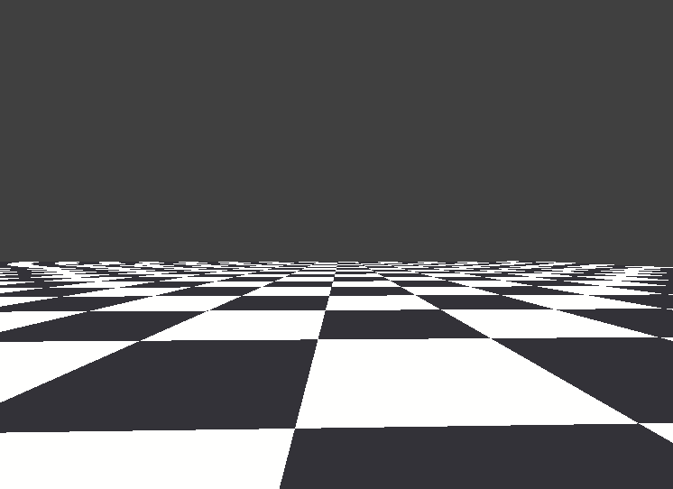

# :skull: BONEZONE CLEANUP : SOURCE CODE :skull:

### A source code of my little collect-a-thon game entry for [Talkative Server World Wide Jam #1](https://itch.io/jam/tsww-jam-1), written in 48 hours over the span of a weekend back in 2019, September.
### See the game's itch.io page HERE : [zikbakguru.itch.io/bonezone](https://zikbakguru.itch.io/bonezone)

## The game features...
* PS1-like retro effects such as vertex position precision crusher(?) effect & emulated texture warping effect caused by affine-texture mapping
* Random rainbow tint applied to model's vertex for aesthetic purposes
* Crude dialogue & item collect-a-thon gameplay
* Trippy music & sounds for peak ａｅｓｔｈｅｔｉｃｓ, synthesized with [LabChirp](https://labbed.itch.io/labchirp)
* Procedurally generated map with randomly generated NPCs and item with random names and descriptions

## Credits
* All the assets except the music were made by me!
* Music used : Chopin - Nocturne op.9 No.2 (slowed down using paulstretch effect & reverb effect applied in Audacity)

## Developement progress & misc. footages

